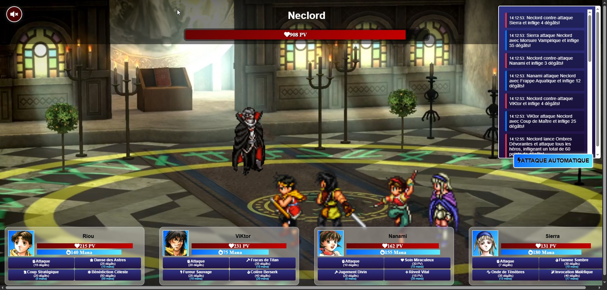

# 🎮 Royal Rumble - Suikoden II Edition

Bienvenue dans **Royal Rumble**, un jeu au tour par tour inspiré de l'univers épique de **Suikoden II** ! Incarnez les héros légendaires **Riou**, **Nanami**, **Viktor** et **Sierra** dans leur combat héroïque contre le redoutable **Neclord**. 🧛‍♂️

## 🌟 À propos du projet

Ce projet est basé sur l'exercice suivant : [React-Redux-Royal-Rumble-Partie-1](https://github.com/G404-DWWM/React-Redux-Royal-Rumble-Partie-1). Il a été enrichi pour offrir une expérience immersive avec des fonctionnalités supplémentaires comme des musiques dynamiques en fonction des phases de combat. 🎵

L'objectif principal de ce projet est d'apprendre et de pratiquer les technologies **React** et **Redux Toolkit** tout en s'amusant avec un jeu interactif.

---

## 🚀 Fonctionnalités

- **Combat au tour par tour** : Chaque personnage dispose de compétences uniques pour attaquer, soigner ou ressusciter ses alliés.
- **Gestion stratégique** : Utilisez vos ressources (PV, mana) avec soin pour vaincre Neclord.
- **Journal de combat** : Suivez chaque action grâce à un journal détaillé.

---

## 🛠️ Technologies utilisées

- **React** ⚛️ : Pour construire une interface utilisateur interactive et réactive.
- **Redux Toolkit** 🛠️ : Pour gérer l'état global du jeu de manière efficace et simplifiée.
- **Vite** ⚡ : Pour un environnement de développement rapide et moderne.
- **JavaScript** : Langage principal pour la logique du jeu.
- **HTML/CSS** 🎨 : Pour le rendu visuel et le style.

---

## 📖 Objectifs pédagogiques

Ce projet est conçu pour :

1. **Apprendre Redux Toolkit** : Comprendre la gestion d'état global dans une application React.
2. **Renforcer les compétences en React** : Manipuler les composants, les props et le state.
3. **Explorer la logique de jeu** : Implémenter des mécaniques de combat au tour par tour.
4. **Créer une expérience utilisateur immersive** : Ajouter des musiques et des effets visuels.

---

## 🕹️ Comment jouer ?

### 1. Installation
Clonez ce dépôt et installez les dépendances :
```bash
git clone https://github.com/Moonyelit/Royal-Rumble.git
cd royal-rumble
npm install
```

### 2. Lancer le jeu
Démarrez le serveur de développement :
```bash
npm run dev
```

### 3. Règles du jeu
- Chaque personnage a des **points de vie (PV)** et des **points de mana (PM)**.
- Utilisez des attaques, des soins ou des résurrections pour vaincre Neclord.
- Si tous les personnages sont vaincus, c'est la **défaite**. Si Neclord est vaincu, c'est la **victoire** !

---

## 📷 Aperçu



---

## 💡 Informations importantes

⚠️ **Ce jeu a été conçu exclusivement pour ordinateur.**  
Il n'existe pas encore de version mobile.

---

## 💡 Inspirations

Ce projet s'inspire de l'univers de **Suikoden II**, un RPG culte des années 90. Les personnages et le boss, **Neclord**, sont des hommages à ce jeu légendaire.

---

## 🤝 Contribuer

Les contributions sont les bienvenues ! Si vous souhaitez améliorer le projet ou ajouter des fonctionnalités, n'hésitez pas à soumettre une pull request.


---

🎉 **Amusez-vous bien et que la lumière des 108 étoiles vous guide dans votre combat contre Neclord !**
